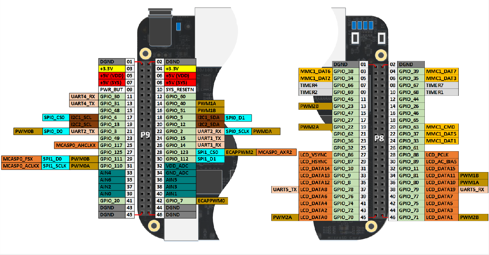

# Enabling and Using SPI on BeagleBone Black with Debian OS

## Prerequisites
- BeagleBone Black
- Debian OS installed on BeagleBone Black
- Internet connection

---

## Steps

### 1. Update and Upgrade the System
Open a terminal and run the following commands:
```bash
sudo apt-get update
sudo apt-get upgrade
```

---

### 2. Edit `uEnv.txt`
Edit the `/boot/uEnv.txt` file to enable SPI:
```bash
sudo nano /boot/uEnv.txt
```

#### Disable HDMI
Add the following line to disable HDMI:
```bash
disable_uboot_overlay_video=1
```

#### Enable SPI
Uncomment or add the following lines to enable SPI:
```bash
uboot_overlay_addr4=/lib/firmware/BB-SPIDEV0-00A0.dtbo
uboot_overlay_addr5=/lib/firmware/BB-SPIDEV1-00A0.dtbo
```

Save and exit the editor (`Ctrl+X`, then `Y`, then `Enter`).

---

### 3. Reboot the System
Reboot your BeagleBone Black to apply the changes:
```bash
sudo reboot
```

---

### 4. Verify SPI
After rebooting, verify that SPI is enabled by checking the available SPI devices:
```bash
ls /dev/spidev*
```
You should see something like `/dev/spidev1.0`.

---

#### <u>Understanding SPI Device Naming</u>
When checking available SPI devices, you may see entries like `/dev/spidev0.0` and `/dev/spidev0.1`. These correspond to **SPI bus 0** with different chip selects:

- **/dev/spidev0.0**: SPI bus 0 with chip select 0 (CS0).
- **/dev/spidev0.1**: SPI bus 0 with chip select 1 (CS1).

The suffix `.0` and `.1` indicate different chip selects on the same SPI bus.

> ⚠️ *Note: This section requires verification.*

---

### 5. Test SPI
The developer **Derek Molloy** provides code for testing SPI on the BeagleBone Black in Chapter 8 of his repository:  
🔗 [exploringBB](https://github.com/derekmolloy/exploringBB/tree/version2)

To use the [spidev_test](https://github.com/derekmolloy/exploringBB/tree/version2/chp08/spi/spidev_test) program, connect:

- `SPI0_D0` to `SPI0_D1` (for testing SPI0), or  
- `SPI1_D0` to `SPI1_D1` (for testing SPI1)

Then compile and run the program:
```bash
gcc -o spidev_test spidev_test.c && sudo ./spidev_test
```

You can change the device file in the source code, or pass arguments to customize behavior. The default device is defined in the code like this:
```c
static const char *device = "/dev/spidev1.0";  // Can also be "/dev/spidev0.0"
static uint8_t mode;
static uint8_t bits = 8;
static uint32_t speed = 500000;
static uint16_t delay;
```

Get help options with:
```bash
./spidev_test --h
```

---

# Programming with SPI Interface

## Using `spidev.h`
To use SPI in C, include the `spidev.h` library located at:
```
/usr/include/linux/spi/spidev.h
```

📄 Reference: [spidev on GitHub](https://github.com/jeffegg/beaglebone/blob/master/Documentation/spi/spidev)

---

## SPI in Device Tree Overlay
SPI configuration is managed via the overlay file:
```
BB-SPIDEV1-00A0.dtbo
```

---

## `spi_ioc_transfer`
A good reference for the `spi_ioc_transfer` structure can be found here:  
🔗 [RTEMS Documentation](https://ftp.rtems.org/pub/rtems/docs/5.1/doxygen/structspi__ioc__transfer.html)

---

# Miscellaneous

## Alternative: Configure Pins with `config-pin`
When permanent configuration is not needed, you can use `config-pin`. This is useful in scripts or when unsure of a pin's state.

Check possible pin modes:
```bash
config-pin -l P9.17
```

Check the current pin state:
```bash
config-pin -q P9.17
```

### Configure SPI Pins
```bash
sudo config-pin P9.17 spi    # Enable SPI0_CS0
sudo config-pin P9.18 spi    # Enable SPI0_CLK
sudo config-pin P9.21 spi    # Enable SPI0_MISO
sudo config-pin P9.22 spi    # Enable SPI0_MOSI 
```

📄 Reference: [The correct way to enable SPI ports on BeagleBone Black](https://arcanesciencelab.wordpress.com/2020/01/14/the-correct-way-to-enable-spi-ports-on-the-beaglebone-black/)

---

## Sidenotes

### Concatenate Commands
Instead of running steps one by one, you can chain them:
```bash
rm -f main && gcc -o main main.c && sudo chmod 777 main && sudo ./main
```

---

### BeagleBone Black - Pinout
- `/dev/spidev1.0` is connected to pins **P9.29** and **P9.30** (SPI1)
- `/dev/spidev0.0` is connected to pins **P9.18** and **P9.21** (SPI0)



---

## SPI with Python (Not Tested)
Install necessary packages:
```bash
sudo apt-get install python3-pip
pip3 install Adafruit_BBIO
```

### Example Python Code
```python
import Adafruit_BBIO.SPI as SPI

spi = SPI.SPI(1, 0)  # Use spidev1.0
spi.open(1, 0)

# Send and receive data
response = spi.xfer2([0x01, 0x02, 0x03])
print(response)

spi.close()
```
